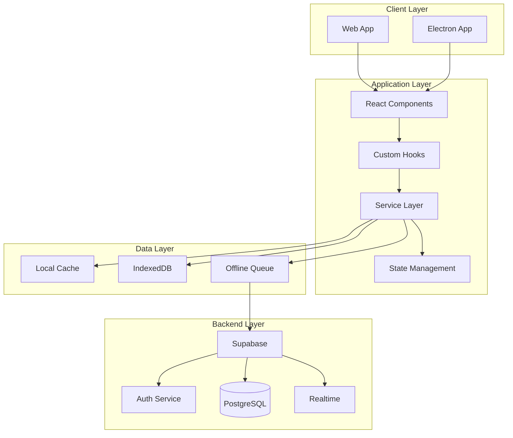

# Retentive App - System Architecture Documentation

## Table of Contents
1. [System Overview](#system-overview)
2. [Architecture Principles](#architecture-principles)
3. [Technology Stack](#technology-stack)
4. [System Architecture](#system-architecture)
5. [Application Layers](#application-layers)
6. [Data Flow Architecture](#data-flow-architecture)
7. [Component Architecture](#component-architecture)
8. [Service Architecture](#service-architecture)
9. [State Management](#state-management)
10. [Security Architecture](#security-architecture)
11. [Performance Architecture](#performance-architecture)
12. [Deployment Architecture](#deployment-architecture)

---

## System Overview

Retentive is a cross-platform spaced repetition learning application built with modern web technologies and delivered as both a desktop application (via Electron) and web application. The system employs a multi-layered architecture with clear separation of concerns, real-time synchronization, and offline-first capabilities.

### Implemented Features
- **Offline-First**: Full functionality without internet connection using IndexedDB
- **Real-Time Sync**: Instant updates across devices via Supabase Realtime
- **Cross-Platform**: Single codebase running on web and desktop (Electron)
- **Secure Authentication**: Supabase Auth with Row Level Security
- **Performance Optimized**: Lazy loading, caching, and request deduplication
- **Gamification System**: Points, levels, achievements, and streaks
- **Spaced Repetition**: Advanced algorithm with multiple learning modes
- **Desktop Notifications**: System-level reminders and alerts

---

## Architecture Principles

### 1. Separation of Concerns
- **Presentation Layer**: React components handle UI
- **Business Logic Layer**: Services manage domain logic
- **Data Access Layer**: Unified data service abstracts storage
- **Infrastructure Layer**: Platform-specific implementations

### 2. Single Responsibility
- Each service handles one domain area
- Components focus on presentation
- Hooks encapsulate reusable logic
- Utils provide pure functions

### 3. Dependency Inversion
- Services depend on interfaces, not implementations
- React components consume services through hooks
- Platform-specific code isolated in adapters

### 4. Don't Repeat Yourself (DRY)
- Shared components in UI library
- Common utilities centralized
- Service singletons prevent duplication
- CSS variables for design tokens

---

## Technology Stack

### Frontend Core
```
├── React 18.3.1          # UI Framework
├── TypeScript 5.6.3      # Type Safety
├── Vite 6.0.5           # Build Tool
├── React Router 7.1.1   # Navigation
└── CSS Modules          # Scoped Styling
```

### Desktop Platform
```
├── Electron 33.3.1      # Desktop Runtime
├── electron-vite        # Electron-specific bundling
└── Native APIs          # File system, notifications
```

### Backend & Data
```
├── Supabase             # Backend as a Service
│   ├── PostgreSQL       # Primary Database
│   ├── Row Level Security # Authorization
│   ├── Realtime         # WebSocket subscriptions
│   └── Auth             # Authentication service
└── Edge Functions       # Serverless compute (future)
```

### State & Storage
```
├── React Context        # Global state management
├── IndexedDB           # Offline data storage
├── LocalStorage        # Settings & cache
└── Electron Store      # Desktop secure storage
```

### Development Tools
```
├── ESLint              # Code quality
├── Prettier            # Code formatting
├── Vitest              # Unit testing (configured)
├── Playwright          # E2E testing (planned)
└── GitHub Actions      # CI/CD pipeline
```

---

## System Architecture



---

## Application Layers

### 1. Presentation Layer
**Location**: `/src/components/`, `/src/pages/`

**Responsibilities**:
- User interface rendering
- User interaction handling
- Visual feedback (toasts, modals)
- Responsive design adaptation

**Key Components**:
```typescript
├── pages/
│   ├── HomePage.tsx         # Dashboard & overview
│   ├── StudyPage.tsx        # Review interface
│   ├── TopicsPage.tsx       # Topic management
│   ├── StatsPage.tsx        # Analytics dashboard
│   └── SettingsPage.tsx     # User preferences
├── components/
│   ├── ui/                  # Reusable UI components
│   ├── topics/              # Topic-specific components
│   ├── gamification/        # Achievement & progress
│   └── layout/              # App structure components
```

### 2. Business Logic Layer
**Location**: `/src/services/`

**Responsibilities**:
- Domain logic implementation
- Data transformation
- Business rules enforcement
- External service integration

**Service Architecture**:
```typescript
// Singleton pattern for all services
class ServiceName {
  private static instance: ServiceName
  
  private constructor() {}
  
  public static getInstance(): ServiceName {
    if (!ServiceName.instance) {
      ServiceName.instance = new ServiceName()
    }
    return ServiceName.instance
  }
}
```

### 3. Data Access Layer
**Location**: `/src/services/dataService*.ts`

**Responsibilities**:
- Abstract data operations
- Handle online/offline scenarios
- Manage data synchronization
- Cache coordination

**Data Flow**:
```
User Action → Component → Hook → Service → Data Layer → Storage
                                     ↓
                              Optimistic Update
                                     ↓
                              Background Sync
```

### 4. Infrastructure Layer
**Location**: `/electron/`, `/src/utils/`

**Responsibilities**:
- Platform-specific implementations
- System integration (notifications, file system)
- Security (encryption, secure storage)
- Performance optimizations

---

## Component Architecture

### Component Hierarchy
```
App.tsx
├── AuthProvider
├── ThemeProvider
├── ToastProvider
├── RouterProvider
│   ├── Layout
│   │   ├── Navigation
│   │   ├── MainContent
│   │   │   └── [Page Components]
│   │   └── Footer
│   └── Routes
```

### Component Patterns

#### 1. Container/Presentational Pattern
```typescript
// Container Component (Smart)
function TopicListContainer() {
  const { topics, loading } = useTopics()
  return <TopicList topics={topics} loading={loading} />
}

// Presentational Component (Dumb)
function TopicList({ topics, loading }: Props) {
  return /* Pure UI rendering */
}
```

#### 2. Compound Components
```typescript
<Card>
  <Card.Header>Title</Card.Header>
  <Card.Content>Content</Card.Content>
  <Card.Footer>Actions</Card.Footer>
</Card>
```

#### 3. Render Props Pattern
```typescript
<DataProvider
  render={(data) => <DisplayComponent data={data} />}
/>
```

---

## Service Architecture

### Core Services

#### 1. Authentication Service
**Files**: `/src/services/authFixed.ts`, `/src/services/authService.ts`
```typescript
interface AuthService {
  signIn(email: string, password: string): Promise<User>
  signUp(email: string, password: string): Promise<User>
  signOut(): Promise<void>
  resetPassword(email: string): Promise<void>
  getCurrentUser(): User | null
  onAuthStateChange(callback: Function): Subscription
}
```

#### 2. Data Service
**Files**: `/src/services/dataService.ts`, `dataServiceOffline.ts`
```typescript
interface DataService {
  // Topics
  getTopics(userId: string): Promise<Topic[]>
  createTopic(topic: Topic): Promise<Topic>
  updateTopic(id: string, updates: Partial<Topic>): Promise<Topic>
  deleteTopic(id: string): Promise<void>
  
  // Learning Items
  getTopicItems(topicId: string): Promise<LearningItem[]>
  createLearningItem(item: LearningItem): Promise<LearningItem>
  updateLearningItem(id: string, updates: Partial<LearningItem>): Promise<LearningItem>
  deleteLearningItem(id: string): Promise<void>
  
  // Review Sessions
  recordReview(session: ReviewSession): Promise<void>
  getReviewHistory(userId: string): Promise<ReviewSession[]>
}
```

#### 3. Spaced Repetition Service
**File**: `/src/services/spacedRepetitionGamified.ts`
```typescript
interface SpacedRepetitionService {
  calculateNextReview(item: LearningItem, quality: number): Date
  getOptimalInterval(reviewCount: number, mode: LearningMode): number
  checkReviewWindow(item: LearningItem): ReviewWindow
}
```

#### 4. Gamification Service
**Files**: `/src/services/gamificationService*.ts`
```typescript
interface GamificationService {
  // Points & Levels
  awardPoints(userId: string, points: number, reason: string): Promise<void>
  calculateLevel(xp: number): LevelInfo
  
  // Achievements
  checkAchievements(userId: string, trigger: AchievementTrigger): Promise<Achievement[]>
  unlockAchievement(userId: string, achievementId: string): Promise<void>
  
  // Streaks
  updateStreak(userId: string): Promise<StreakInfo>
  checkStreakStatus(userId: string): Promise<boolean>
}
```

#### 5. Notification Service
**File**: `/src/services/notificationService.ts`
```typescript
interface NotificationService {
  scheduleReminder(userId: string, time: string): Promise<void>
  scheduleItemDue(item: LearningItem): Promise<void>
  sendTestNotification(): Promise<boolean>
  cancelNotification(id: string): Promise<void>
  applySettings(settings: NotificationSettings): Promise<void>
}
```

#### 6. Sync Service
**File**: `/src/services/syncService.ts`
```typescript
interface SyncService {
  initialize(userId: string): Promise<void>
  syncNow(): Promise<SyncResult>
  queueOperation(operation: SyncOperation): void
  resolveConflicts(local: any, remote: any): any
  subscribeToChanges(callback: Function): Subscription
}
```

#### 7. Statistics Service
**File**: `/src/services/statsService.ts`
```typescript
interface StatsService {
  getOverviewStats(userId: string): Promise<OverviewStats>
  getTopicStats(topicId: string): Promise<TopicStats>
  getTimingAnalytics(userId: string): Promise<TimingStats>
  getProgressMetrics(userId: string): Promise<ProgressMetrics>
  exportStats(userId: string, format: string): Promise<Blob>
}
```

#### 8. Realtime Service
**File**: `/src/services/realtimeService.ts`
```typescript
interface RealtimeService {
  subscribe(channel: string, callback: Function): Subscription
  unsubscribe(subscription: Subscription): void
  broadcast(channel: string, message: any): void
  presence(channel: string): PresenceState
}
```

#### 9. Offline Queue Service
**File**: `/src/services/offlineQueue.ts`
```typescript
interface OfflineQueueService {
  enqueue(operation: QueueOperation): void
  dequeue(): QueueOperation | null
  process(): Promise<void>
  clear(): void
  getQueueSize(): number
}
```

#### 10. Cache Service
**File**: `/src/services/localStorageCache.ts`
```typescript
interface CacheService {
  get<T>(key: string): T | null
  set<T>(key: string, value: T, ttl?: number): void
  invalidate(pattern?: string): void
  clear(): void
}
```

#### 11. Request Deduplicator
**File**: `/src/services/requestDeduplicator.ts`
```typescript
interface RequestDeduplicator {
  dedupe<T>(key: string, request: () => Promise<T>): Promise<T>
  clear(key?: string): void
}
```

### Service Communication
```
┌─────────────┐     ┌─────────────┐     ┌─────────────┐
│   UI Layer  │────▶│   Service   │────▶│    Data     │
│             │◀────│    Layer    │◀────│   Storage   │
└─────────────┘     └─────────────┘     └─────────────┘
                           │
                           ▼
                    ┌─────────────┐
                    │   Events    │
                    │   PubSub    │
                    └─────────────┘
```

---

## Custom Hooks Architecture

### Core Hooks

#### 1. useAuth / useAuthFixed
**Files**: `/src/hooks/useAuth.tsx`, `/src/hooks/useAuthFixed.tsx`
```typescript
interface UseAuth {
  user: User | null
  loading: boolean
  error: Error | null
  signIn: (email: string, password: string) => Promise<void>
  signOut: () => Promise<void>
}
```

#### 2. useStats / useOptimizedStats
**Files**: `/src/hooks/useStats.tsx`, `/src/hooks/useOptimizedStats.tsx`
```typescript
interface UseStats {
  stats: Statistics
  loading: boolean
  refresh: () => Promise<void>
}
```

#### 3. useAchievements
**File**: `/src/hooks/useAchievements.tsx`
```typescript
interface UseAchievements {
  achievements: Achievement[]
  showAchievements: (achievements: Achievement[]) => void
  checkAchievements: () => Promise<void>
}
```

#### 4. useOnlineStatus
**File**: `/src/hooks/useOnlineStatus.tsx`
```typescript
interface UseOnlineStatus {
  isOnline: boolean
  lastOnline: Date | null
}
```

#### 5. useAutoSave
**File**: `/src/hooks/useAutoSave.ts`
```typescript
interface UseAutoSave {
  save: (data: any) => void
  isPending: boolean
  lastSaved: Date | null
}
```

#### 6. usePagination
**File**: `/src/hooks/usePagination.ts`
```typescript
interface UsePagination<T> {
  items: T[]
  currentPage: number
  totalPages: number
  nextPage: () => void
  prevPage: () => void
  goToPage: (page: number) => void
}
```

---

## Error Handling Architecture

### Error Boundary
**File**: `/src/components/ErrorBoundary.tsx`
```typescript
class ErrorBoundary extends Component {
  static getDerivedStateFromError(error: Error): State
  componentDidCatch(error: Error, errorInfo: ErrorInfo): void
  render(): ReactNode
}
```

### Logger Service
**File**: `/src/utils/logger.ts`
```typescript
interface Logger {
  log(message: string, ...args: any[]): void
  error(message: string, error?: Error): void
  warn(message: string, ...args: any[]): void
  info(message: string, ...args: any[]): void
  debug(message: string, ...args: any[]): void
}
```

### Error Utils
**File**: `/src/utils/errors.ts`
```typescript
class AppError extends Error {
  code: string
  statusCode?: number
  isOperational: boolean
}

function handleError(error: Error): void
function isOperationalError(error: Error): boolean
```

---

## State Management

### Global State Architecture

#### 1. Authentication Context
```typescript
interface AuthContext {
  user: User | null
  loading: boolean
  error: Error | null
  signIn: (email: string, password: string) => Promise<void>
  signOut: () => Promise<void>
}
```

#### 2. Theme Context
```typescript
interface ThemeContext {
  theme: 'light' | 'dark' | 'system'
  setTheme: (theme: Theme) => void
  resolvedTheme: 'light' | 'dark'
}
```

#### 3. App State Context
```typescript
interface AppContext {
  isOnline: boolean
  isSyncing: boolean
  syncStatus: SyncStatus
  notifications: Notification[]
}
```

### Local State Patterns

#### 1. Component State
```typescript
// Simple state for UI interactions
const [isExpanded, setIsExpanded] = useState(false)
const [selectedItem, setSelectedItem] = useState<Item | null>(null)
```

#### 2. Reducer Pattern
```typescript
// Complex state with multiple related updates
const [state, dispatch] = useReducer(reducer, initialState)

dispatch({ type: 'ADD_ITEM', payload: item })
dispatch({ type: 'UPDATE_STATUS', payload: status })
```

#### 3. Optimistic Updates
```typescript
// Update UI immediately, sync in background
const optimisticUpdate = async (item: Item) => {
  setItems(prev => [...prev, item])  // Optimistic
  try {
    await api.createItem(item)        // Actual
  } catch (error) {
    setItems(prev => prev.filter(i => i.id !== item.id))  // Rollback
  }
}
```

---

## Utility Functions Architecture

### Core Utilities

#### 1. Time Formatting
**File**: `/src/utils/timeFormat.ts`
```typescript
formatDuration(ms: number): string
formatReviewDate(date: Date): string
getOptimalReviewWindow(item: LearningItem): ReviewWindow
calculateReviewTiming(item: LearningItem): TimingInfo
```

#### 2. Data Validation
**File**: `/src/utils/validation.ts`
```typescript
validateEmail(email: string): boolean
validatePassword(password: string): ValidationResult
sanitizeInput(input: string): string
validateTopicData(data: unknown): Topic
```

#### 3. Formatters
**File**: `/src/utils/formatters.ts`
```typescript
formatNextReview(date: Date): string
formatProgress(current: number, total: number): string
formatNumber(num: number): string
formatFileSize(bytes: number): string
```

#### 4. Date Utilities
**File**: `/src/utils/date.ts`
```typescript
isToday(date: Date): boolean
isOverdue(date: Date): boolean
getDaysBetween(date1: Date, date2: Date): number
getRelativeTime(date: Date): string
```

#### 5. Debounce Utility
**File**: `/src/utils/debounce.ts`
```typescript
function debounce<T extends (...args: any[]) => any>(
  func: T,
  wait: number
): DebouncedFunction<T>
```

#### 6. Import/Export Utilities
**Files**: `/src/utils/dataImport.ts`, `/src/utils/dataExport.ts`
```typescript
interface ImportExport {
  exportToJSON(data: any): Blob
  exportToCSV(data: any[]): Blob
  importFromJSON(file: File): Promise<any>
  importFromCSV(file: File): Promise<any[]>
}
```

---

## Data Flow Architecture

### Online Data Flow
```
User Action
    ↓
Component Event Handler
    ↓
Custom Hook
    ↓
Service Method
    ↓
Supabase API Call
    ↓
PostgreSQL Database
    ↓
Realtime Broadcast
    ↓
Other Clients Update
```

### Offline Data Flow
```
User Action
    ↓
Component Event Handler
    ↓
Custom Hook
    ↓
Service Method
    ↓
IndexedDB Write
    ↓
Offline Queue
    ↓
Background Sync (when online)
    ↓
Conflict Resolution
    ↓
Final State
```

### Caching Strategy
```typescript
interface CacheStrategy {
  // Memory Cache (React State)
  memory: {
    ttl: 5 * 60 * 1000,  // 5 minutes
    maxSize: 100         // items
  },
  
  // Local Storage Cache
  localStorage: {
    ttl: 24 * 60 * 60 * 1000,  // 24 hours
    maxSize: 5 * 1024 * 1024   // 5MB
  },
  
  // IndexedDB Cache
  indexedDB: {
    ttl: 7 * 24 * 60 * 60 * 1000,  // 7 days
    maxSize: 50 * 1024 * 1024      // 50MB
  }
}
```

---

## Electron Architecture

### Main Process
**File**: `/electron/main.ts`
```typescript
// Main process responsibilities
- Window management
- System tray integration
- IPC communication
- Native menus
- File system access
- Auto-updater
- Deep linking
```

### Preload Scripts
**File**: `/electron/preload.ts`
```typescript
// Context bridge API
window.electronAPI = {
  // Database operations
  database: {
    getTopics: () => Promise<Topic[]>
    createTopic: (topic: Topic) => Promise<Topic>
    updateTopic: (id: string, updates: Partial<Topic>) => Promise<Topic>
  },
  
  // Secure storage
  secureStorage: {
    get: (key: string) => Promise<string | null>
    set: (key: string, value: string) => Promise<void>
    delete: (key: string) => Promise<void>
  },
  
  // Notifications
  notifications: {
    schedule: (type: string, data: any) => Promise<boolean>
    cancel: (type: string, id: string) => Promise<boolean>
    test: () => Promise<boolean>
  },
  
  // System operations
  system: {
    openExternal: (url: string) => Promise<void>
    showItemInFolder: (path: string) => Promise<void>
    getVersion: () => Promise<string>
  }
}
```

### IPC Communication
```typescript
// Main → Renderer
mainWindow.webContents.send('event-name', data)

// Renderer → Main
window.electronAPI.methodName(args)

// Two-way communication
ipcMain.handle('channel', async (event, args) => {
  return result
})
```

### Local Database
**Files**: `/electron/database.ts`, `/electron/database/localDatabase.ts`
```typescript
interface LocalDatabase {
  // SQLite operations for offline storage
  initialize(): Promise<void>
  query<T>(sql: string, params?: any[]): Promise<T[]>
  execute(sql: string, params?: any[]): Promise<void>
  transaction(operations: Operation[]): Promise<void>
}
```

### Notification Service (Electron)
**File**: `/electron/notificationService.ts`
```typescript
class NotificationService {
  // Native OS notifications
  sendNotification(title: string, body: string): void
  
  // Scheduled notifications with node-schedule
  scheduleDailyReminder(userId: string, time: string): void
  scheduleStreakCheck(userId: string): void
  scheduleItemDueNotification(item: LearningItem): void
  
  // Job management
  cancelJob(jobId: string): void
  cancelUserJobs(userId: string): void
}
```

---

## Security Architecture

### Authentication Flow
```
1. User enters credentials
2. Client validates input
3. Supabase Auth API call
4. JWT token received
5. Token stored securely
6. Auto-refresh mechanism
7. Protected route access
```

### Authorization Layers

#### 1. Row Level Security (RLS)
```sql
-- PostgreSQL RLS Policies
CREATE POLICY "Users can only see own data"
ON learning_items
FOR ALL
USING (auth.uid() = user_id);
```

#### 2. Application Level
```typescript
// Route protection
<ProtectedRoute requireAuth={true}>
  <Component />
</ProtectedRoute>

// API validation
if (userId !== auth.currentUser?.id) {
  throw new UnauthorizedError()
}
```

#### 3. Secure Storage
```typescript
// Desktop: Electron secure storage
await window.electronAPI.secureStorage.set('token', encrypted)

// Web: HttpOnly cookies + HTTPS
document.cookie = `token=${token}; Secure; HttpOnly; SameSite=Strict`
```

### Data Protection

#### 1. Encryption
- **At Rest**: Supabase database encryption
- **In Transit**: TLS/HTTPS for all connections
- **Local Storage**: AES encryption for sensitive data

#### 2. Input Validation
```typescript
// XSS Prevention
const sanitizeInput = (input: string) => {
  return DOMPurify.sanitize(input)
}

// SQL Injection Prevention (handled by Supabase)
const { data } = await supabase
  .from('table')
  .select()
  .eq('column', sanitizedValue)  // Parameterized queries
```

#### 3. CORS Configuration
```typescript
// Electron main process
app.on('web-contents-created', (_, contents) => {
  contents.session.webRequest.onHeadersReceived((details, callback) => {
    callback({
      responseHeaders: {
        ...details.responseHeaders,
        'Content-Security-Policy': ["default-src 'self'"]
      }
    })
  })
})
```

---

## Performance Architecture

### Optimization Strategies

#### 1. Code Splitting
```typescript
// Route-based splitting
const StatsPage = lazy(() => import('./pages/StatsPage'))

// Component-based splitting
const HeavyComponent = lazy(() => import('./components/HeavyComponent'))

// Feature-based splitting
const GamificationModule = lazy(() => import('./modules/gamification'))
```

#### 2. Memoization
```typescript
// Component memoization
const TopicCard = memo(({ topic }: Props) => {
  return <div>{topic.name}</div>
}, (prevProps, nextProps) => {
  return prevProps.topic.id === nextProps.topic.id
})

// Value memoization
const expensiveValue = useMemo(() => {
  return computeExpensiveValue(deps)
}, [deps])

// Callback memoization
const stableCallback = useCallback(() => {
  doSomething(deps)
}, [deps])
```

#### 3. Virtual Scrolling
```typescript
// For large lists
import { FixedSizeList } from 'react-window'

<FixedSizeList
  height={600}
  itemCount={items.length}
  itemSize={50}
>
  {({ index, style }) => (
    <div style={style}>
      {items[index].name}
    </div>
  )}
</FixedSizeList>
```

#### 4. Database Optimization
```typescript
// Batch operations
const batchUpdate = async (items: Item[]) => {
  const { data, error } = await supabase
    .from('items')
    .upsert(items)  // Single query for multiple items
}

// Selective fetching
const { data } = await supabase
  .from('items')
  .select('id, name, next_review_at')  // Only needed fields
  .range(0, 49)  // Pagination
```

#### 5. Asset Optimization
```
- Image lazy loading
- WebP format with fallbacks
- SVG for icons
- Font subsetting
- CSS purging
- JS minification
- Compression (gzip/brotli)
```

### Performance Monitoring
```typescript
// Custom performance marks
performance.mark('study-session-start')
// ... user studies ...
performance.mark('study-session-end')
performance.measure('study-session', 'study-session-start', 'study-session-end')

// React DevTools Profiler
<Profiler id="TopicList" onRender={onRenderCallback}>
  <TopicList />
</Profiler>
```

---

## Deployment Architecture

### Build Pipeline
```yaml
# GitHub Actions CI/CD
name: Build and Deploy
on:
  push:
    branches: [main]
    
jobs:
  test:
    runs-on: ubuntu-latest
    steps:
      - uses: actions/checkout@v2
      - run: npm ci
      - run: npm run lint
      - run: npm run typecheck
      - run: npm test
      
  build-web:
    needs: test
    runs-on: ubuntu-latest
    steps:
      - run: npm run build
      - uses: actions/upload-artifact@v2
      
  build-desktop:
    needs: test
    strategy:
      matrix:
        os: [ubuntu-latest, windows-latest, macos-latest]
    runs-on: ${{ matrix.os }}
    steps:
      - run: npm run build:electron
      - run: npm run dist
```

### Environment Configuration
```typescript
// Environment-specific configs
const config = {
  development: {
    apiUrl: 'http://localhost:54321',
    debug: true,
    mockData: true
  },
  staging: {
    apiUrl: 'https://staging.retentive.app',
    debug: true,
    mockData: false
  },
  production: {
    apiUrl: 'https://api.retentive.app',
    debug: false,
    mockData: false
  }
}
```

### Distribution Channels

#### Web Deployment
```
1. Build static assets (Vite)
2. Upload to CDN (CloudFlare/Vercel)
3. Configure edge functions
4. Set up SSL certificates
5. Configure domain routing
```

#### Desktop Distribution
```
1. Code signing certificates
2. Auto-update server setup
3. Platform packages:
   - Windows: NSIS installer
   - macOS: DMG with notarization
   - Linux: AppImage/Snap/Flatpak
4. GitHub Releases
5. Platform stores (future)
```

---

## Monitoring & Analytics

### Application Monitoring
```typescript
// Error tracking
window.addEventListener('error', (event) => {
  logger.error('Global error', {
    message: event.message,
    source: event.filename,
    line: event.lineno,
    column: event.colno,
    stack: event.error?.stack
  })
})

// Performance metrics
const metrics = {
  FCP: 'First Contentful Paint',
  LCP: 'Largest Contentful Paint',
  FID: 'First Input Delay',
  CLS: 'Cumulative Layout Shift',
  TTFB: 'Time to First Byte'
}
```

### User Analytics
```typescript
// Privacy-respecting analytics
interface AnalyticsEvent {
  category: 'engagement' | 'learning' | 'system'
  action: string
  label?: string
  value?: number
  userId?: string  // Anonymized
  timestamp: Date
}

// Example events
analytics.track({
  category: 'learning',
  action: 'complete_review',
  label: 'steady_mode',
  value: 15  // items reviewed
})
```

---


## Conclusion

The Retentive app implements a comprehensive architecture with:
- **Offline-First Design**: Full functionality without internet via IndexedDB and local SQLite
- **Real-Time Sync**: Automatic synchronization when online using Supabase Realtime
- **Cross-Platform**: Single codebase for web and desktop via Electron
- **Performance Optimized**: Code splitting, memoization, virtual scrolling, and caching
- **Secure**: Multiple security layers including RLS, encryption, and secure storage
- **Modular Services**: Clean separation with singleton services for each domain

---

## Appendix: File Structure

```
retentive-app/
├── electron/                 # Desktop-specific code
│   ├── main.ts              # Main process
│   ├── preload.ts           # Preload scripts
│   ├── database.ts          # Local database
│   ├── notificationService.ts # System notifications
│   └── ipc/                 # IPC handlers
├── src/
│   ├── components/          # React components
│   │   ├── ui/             # Reusable UI library
│   │   ├── topics/         # Topic components
│   │   ├── gamification/   # Gamification UI
│   │   └── layout/         # Layout components
│   ├── pages/              # Route pages
│   ├── services/           # Business logic
│   ├── hooks/              # Custom React hooks
│   ├── utils/              # Utility functions
│   ├── types/              # TypeScript types
│   ├── styles/             # Global styles
│   ├── constants/          # App constants
│   └── config/             # Configuration
├── docs/                   # Documentation
├── public/                 # Static assets
└── tests/                  # Test files
```